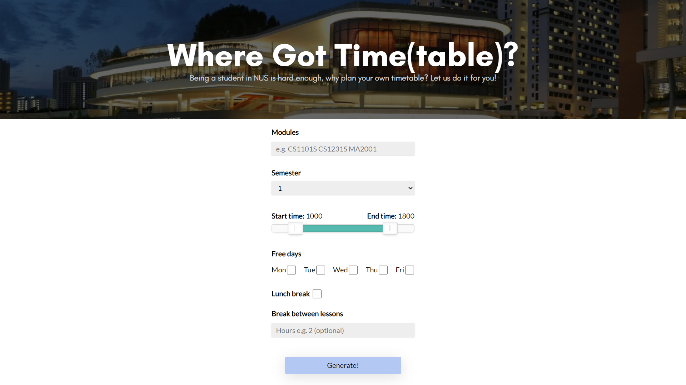
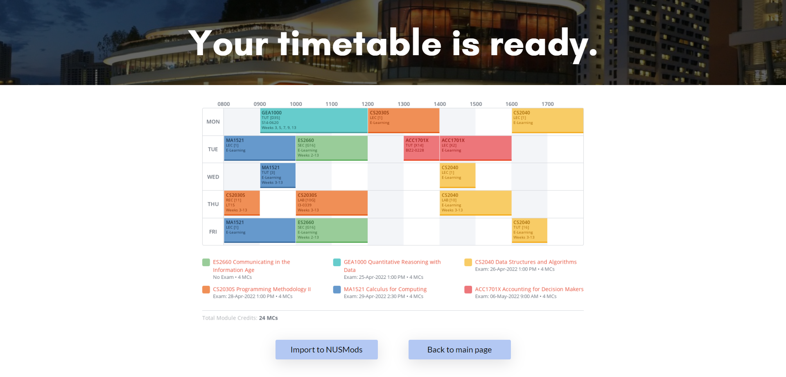

# Where Got Time(table)?
A timetable optimser which uses an evolutionary algorithm to "breed" a timetable suited to your needs.

  

    <a href="https://where-got-time-table.herokuapp.com"><strong>Try it out here!</strong></a>
  

# Inspiration
Planning the best fit timetable to suit our needs can be an absolute nightmare. Different sets of modules can result in a seemingly limitless combinations of timetable. Comparing and choosing the best timetable can take hours or even days. _The struggle is real_

Having chanced upon an article on genetic algorithm, we thought that this would be the best approach to tackling an optimization problem involving timetabling/scheduling. This project aims to provide the most optimized timetable given a set of pre-defined constraints. 

# What It Does

Users can input the following:
- Modules codes for the particular semester
- Adjustable start and end time
- Select free days
- Maximize lunch timings
- Determine minimum hours of break between classes

Based on user inputs, the most optimized timetable is generated.

  

  

# Why It Works
 A Genetic Algorithm mimic the process of natural selection and evolution by combining the "elite" timetables to form the "next generation" of timetables.  

**The evolutionary process:**
1. Extracting, cleaning and generating our own data structure from NUSMods API

2. Initialise the first generation which includes a population of timetables

3. Grading each timetable with a fitness score

4. Cross-over fittest "parents" to generate 2 "child" timetables with mutations 

5. Assign these timetables to the next generation

6. Repeat this process until the fitness score across a generation converges

7. If the soft and hard constraints were not met after reaching the generation limit, the most optimised timetable is returned to the user

# How We Built It
Our main algorithm was written with Python. It utilizes NUSMods API to fetch the relevant mods data. Some filtering and cleaning up of the data grants us a workable data structure. Implementation of the genetic algorithm returns a link that is sent to the web page which generates an image for the user. 

Firstly, we generate a population of timetables. Using a scoring algorithm, we rate the fitness of the timetables. Timetables with a better fitness score gets to produce the next generation of timetables through cross-overs and mutation. 

We repeat this process until the average fitness score of the entire generation converges to within a tolerance range. The fittest timetable from the final generation is returned to the user.

# Challenges We Ran Into
Managing large data structures comes with confusing errors that are hard to pinpoint. 
NUS offers more than 6000 modules, some classes are fixed while others are variable. This results in multiple varying data structures for different modules. As such, our code needs to be robust enough to handle the unique data structures.
Integration of front and backend code was much harder than expected. 

# Accomplishments We're Proud Of
We are proud to have come up with a minimum viable product. 

# What We Learned
As this is our first group project, we learnt how to work on Git Flow, how to push and pull information via Git and version control. _One of us even deleted a whole file and had to rewrite from scratch_
We also learnt how to approach optimization problems and how to use the NUSMods API for parsing data into our program. 

# What's Next For Where Got Time(table)?
Improve the UI/UX of the landing page to facilitate better user experience. Allow more user constraints such as "Minimal Time Spent in School". We will further fine-tune the program which could possibly be used as an extension for the official [NUSMods](https://nusmods.com/). A possible feature that can be added includes a GIF of the user's timetable evolving across generations from start to finish.

# Try It Out
[Where Got Time(table)?](https://where-got-time-table.herokuapp.com/)

# Credits/Reference
[Using Genetic Algorithm to Schedule Timetables](https://towardsdatascience.com/using-genetic-algorithms-to-schedule-timetables-27f132c9e280)
